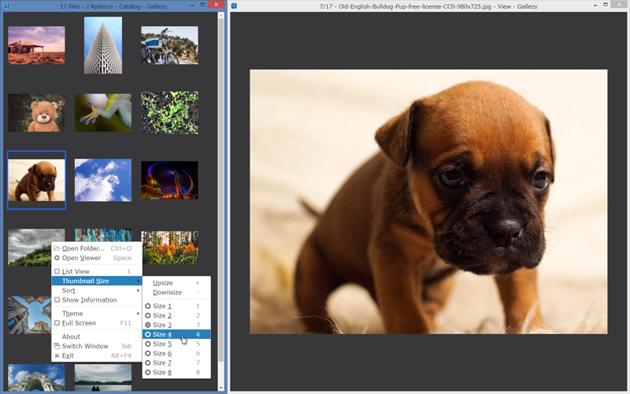

# Gallezy

   

Super Simple Image Gallery App

- You have to learn nothing to use Gallezy.
- You have to configure nothing for Gallezy.

You can operate all of Gallezy by context menu.

## Download

- [Windows x64](https://github.com/anseki/gallezy/releases/download/1.0.0/gallezy-1.0.0-win32-x64.zip)
- [Windows ia32](https://github.com/anseki/gallezy/releases/download/1.0.0/gallezy-1.0.0-win32-ia32.zip)
- [OS X](https://github.com/anseki/gallezy/releases/download/1.0.0/gallezy-1.0.0-darwin-x64.tar.gz)
- [Linux x64](https://github.com/anseki/gallezy/releases/download/1.0.0/gallezy-1.0.0-linux-x64.zip)
- [Linux ia32](https://github.com/anseki/gallezy/releases/download/1.0.0/gallezy-1.0.0-linux-ia32.zip)
- [Checksum](https://github.com/anseki/gallezy/releases/download/1.0.0/SHASUMS256.txt)

Since these don't have code signing, you should check a [checksum](https://github.com/anseki/gallezy/releases/download/1.0.0/SHASUMS256.txt).  
Instant way to get checksum of a file for Windows is [hashfile-contextmenu](https://github.com/anseki/hashfile-contextmenu). And `shasum` or `sha256sum` commands for others.

## Install

Extract a `Gallezy` folder from a downloaded file, and save it into your hard disk.  
For Windows, you can add a command into context menu of Windows Explorer by double-clicking a file `ContextMenu.vbs` in the `Gallezy` folder, *after* saving it.

## Start Gallezy

Open a file in the `Gallezy` folder you saved:

- `Gallezy.exe` on Windows
- `Gallezy.app` on OS X
- `Gallezy` on Linux

Or drag-and-drop a target folder that contains image files onto a Gallezy icon.  
Or right-click the target folder, and select a `Open with Gallezy` command in context menu, or press `Z` key.  
After starting, you can also open the target folder by dropping the folder onto a Gallezy window or its icon, or pressing `Ctrl+O` keys.

## Uninstall

If you added a command into context menu of Windows Explorer, double-click a file `ContextMenu.vbs` to remove the command.  
Remove two folders the `Gallezy` folder you saved and:

- `%APPDATA%\Gallezy` folder on Windows
- `~/Library/Application Support/Gallezy` folder on OS X
- `$XDG_CONFIG_HOME/Gallezy` or `~/.config/Gallezy` folder on Linux
